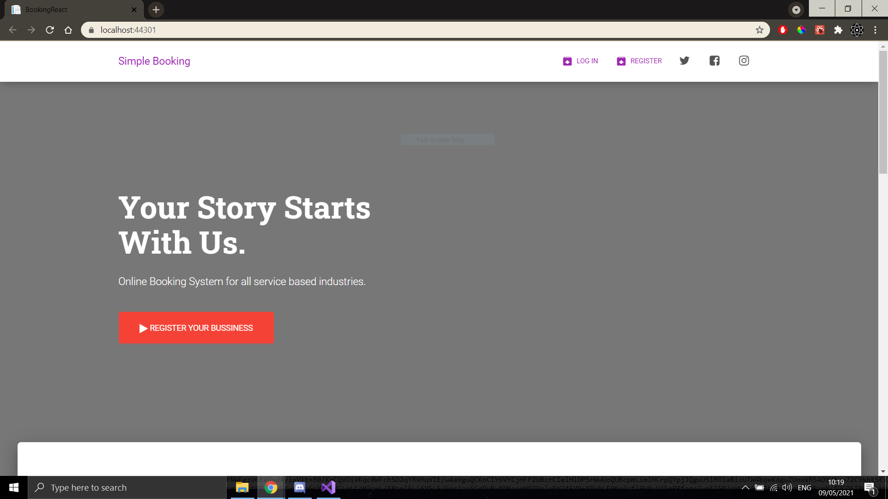

# Bookify 

## About the project

Bookify is a online booking web platform where users can book for a service (Ex: Barber Shop), browsing a list of businesses, sorted by category and city.

On the Main page we can see the categories for bussinesses:

Also on the Main page we have a feedback section. A user can sent review for the website and other users will see the review on the main page.

Once we click on a category we can see all the bussinesses for that category, after that we can sort them by city.

We can click on the 'Show Details' button to see the bussiness page:

Here we can see:
The location on a Bing Map

Photos from the work place

The services that the bussiness offers

The Employees

A user must be logged in to make an appoinment

## Technologies used

For BackEnd:

- C#
- Entity Framework
- Sql database
- Identity Framework

For FrontEnd:

- React Js
- Bootstrap
- HTML/CSS
- Material-Ui

## To run this project

- Set BookingApi and BookingReact as startup projects
- Run